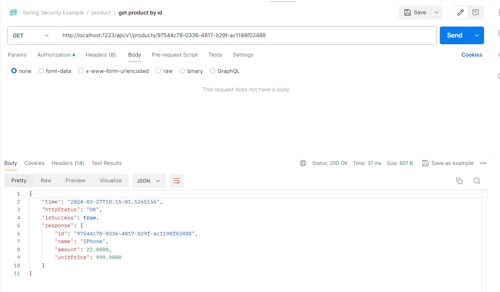

# Spring Boot with Spring Security through JWT Implementation

<p align="center">
    
</p>

### 📖 Information

<ul style="list-style-type:disc">
  <li><b>It</b> is a kind of Spring Boot example with covering important and useful features</li> 
  <li>Here is the explanation of the example
       <ul><b>Admin</b> and <b>User</b> implement their own <b>authentication</b> and <b>authorization</b> through their defined <b>role</b> name</ul>
       <ul><b>Admin</b> handles with creating product, getting all products, getting product by Id, updating product by Id and lastly deleting product by Id</ul>
       <ul><b>Admin</b> only handles with getting all products and getting product by Id</ul>
  </li>
</ul>

### Explore Rest APIs

<table style="width:100%">
  <tr>
      <th>Method</th>
      <th>Url</th>
      <th>Description</th>
      <th>Request Body</th>
      <th>Header</th>
      <th>Valid Path Variable</th>
      <th>No Path Variable</th>
  </tr>
  <tr>
      <td>POST</td>
      <td>/api/v1/authentication/admin/register</td>
      <td>Admin Register</td>
      <td>AdminRegisterRequest</td>
      <td></td>
      <td></td>
      <td></td>
  <tr>
  <tr>
      <td>POST</td>
      <td>/api/v1/authentication/admin/login</td>
      <td>Admin Login</td>
      <td>LoginRequest</td>
      <td></td>
      <td></td>
      <td></td>
  <tr>
  <tr>
      <td>POST</td>
      <td>/api/v1/authentication/admin/refreshtoken</td>
      <td>Admin Refresh Token</td>
      <td>TokenRefreshRequest</td>
      <td></td>
      <td></td>
      <td></td>
  <tr>
  <tr>
      <td>POST</td>
      <td>/api/v1/authentication/admin/logout</td>
      <td>Admin Logout</td>
      <td>TokenInvalidateRequest</td>
      <td></td>
      <td></td>
      <td></td>
  <tr>
  <tr>
      <td>POST</td>
      <td>/api/v1/authentication/user/register</td>
      <td>User Register</td>
      <td>UserRegisterRequest</td>
      <td></td>
      <td></td>
      <td></td>
  <tr>
  <tr>
      <td>POST</td>
      <td>/api/v1/authentication/user/login</td>
      <td>User Login</td>
      <td>LoginRequest</td>
      <td></td>
      <td></td>
      <td></td>
  <tr>
  <tr>
      <td>POST</td>
      <td>/api/v1/authentication/user/refreshtoken</td>
      <td>User Refresh Token</td>
      <td>TokenRefreshRequest</td>
      <td></td>
      <td></td>
      <td></td>
  <tr>
  <tr>
      <td>POST</td>
      <td>/api/v1/authentication/user/logout</td>
      <td>User Logout</td>
      <td>TokenInvalidateRequest</td>
      <td></td>
      <td></td>
      <td></td>
  <tr>
  <tr>
      <td>POST</td>
      <td>/api/v1/products</td>
      <td>Create Product</td>
      <td>ProductCreateRequest</td>
      <td></td>
      <td></td>
      <td></td>
  <tr>
  <tr>
      <td>GET</td>
      <td>/api/v1/products/{productId}</td>
      <td>Get Product By Id</td>
      <td></td>
      <td></td>
      <td>ProductId</td>
      <td></td>
  <tr>
  <tr>
      <td>GET</td>
      <td>/api/v1/products</td>
      <td>Get Products</td>
      <td>ProductPagingRequest</td>
      <td></td>
      <td></td>
      <td></td>
  <tr>
  <tr>
      <td>PUT</td>
      <td>/api/v1/products/{productId}</td>
      <td>Update Product By Id</td>
      <td>ProductUpdateRequest</td>
      <td></td>
      <td>ProductId</td>
      <td></td>
  <tr>
  <tr>
      <td>DELETE</td>
      <td>/api/v1/products/{productId}</td>
      <td>Delete Product By Id</td>
      <td></td>
      <td></td>
      <td>ProductId</td>
      <td></td>
  <tr>
</table>


### Technologies

---
- Java 17
- Spring Boot 3.0
- Restful API
- Lombok
- Maven
- Junit5
- Mockito
- Integration Tests
- Docker
- Docker Compose


### Prerequisites

#### Define Variable in .env file

```
DATABASE_USERNAME={DATABASE_USERNAME}
DATABASE_PASSWORD={DATABASE_PASSWORD}
```

---
- Maven or Docker
---


### Docker Run
The application can be built and run by the `Docker` engine. The `Dockerfile` has multistage build, so you do not need to build and run separately.

Please follow directions shown below in order to build and run the application with Docker Compose file;

```sh
$ cd springbootsecurity
$ docker-compose up -d
```

If you change anything in the project and run it on Docker, you can also use this command shown below

```sh
$ cd springbootsecurity
$ docker-compose up --build
```

---
### Maven Run
To build and run the application with `Maven`, please follow the directions shown below;

```sh
$ cd springbootsecurity
$ mvn clean install
$ mvn spring-boot:run
```

### Screenshots

<details>
<summary>Click here to show the screenshots of project</summary>
    <p> Figure 1 </p>
    
    <p> Figure 2 </p>
    
    <p> Figure 3 </p>
    
    <p> Figure 4 </p>
    
    <p> Figure 5 </p>
    
    <p> Figure 6 </p>
    
    <p> Figure 7 </p>
    
    <p> Figure 8 </p>
    
    <p> Figure 9 </p>
    
    <p> Figure 10 </p>
    
    <p> Figure 11 </p>
    
    <p> Figure 12 </p>
    
    <p> Figure 13 </p>
    
    <p> Figure 14 </p>
    
    <p> Figure 15 </p>
    
    <p> Figure 16 </p>
    
</details>